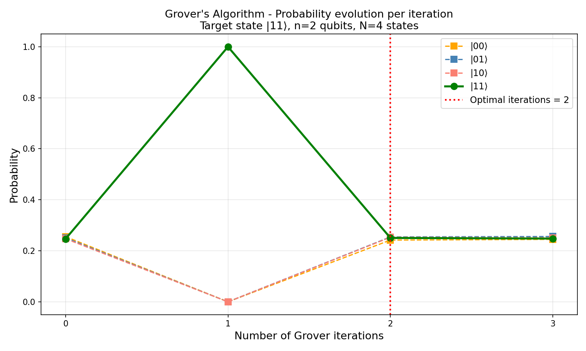
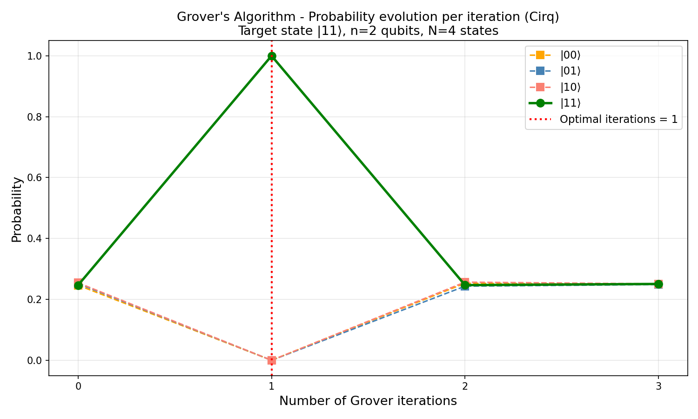
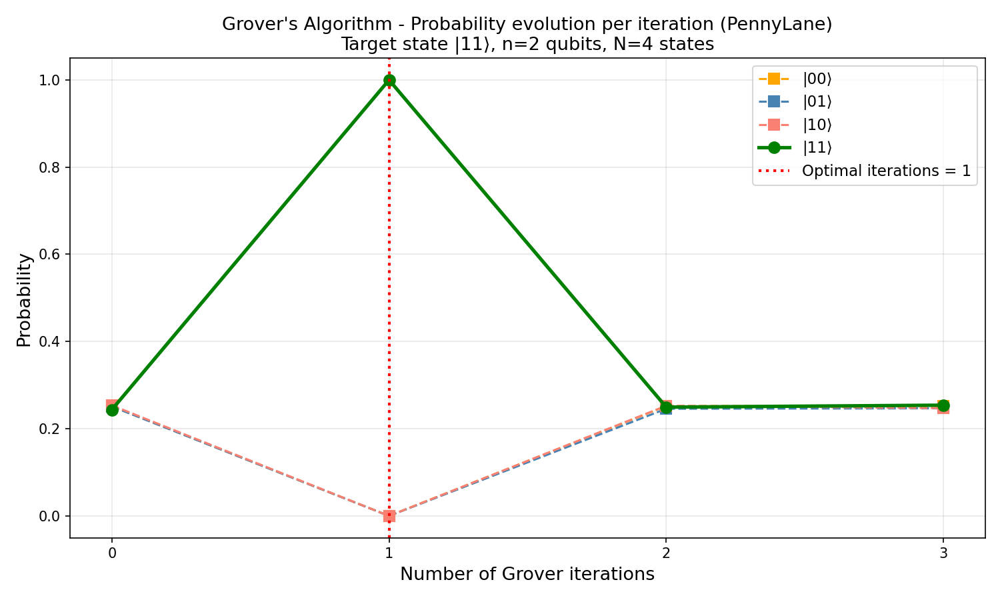

# Algorithme de Grover – Étude comparative de frameworks quantiques

Implémentation de l'algorithme de Grover dans trois environnements de programmation quantique.

## Auteurs
- Djelal Avdyli
- Ryan Dorasamy

## Cours
MA_HPQC - HES-SO MSE

## Frameworks utilisés
- **Qiskit** (IBM) – obligatoire
- **Cirq** (Google)
- **PennyLane** (Xanadu)

## Structure du projet
quantum-grover/
├── src/
│   ├── grover_qiskit.py
│   ├── grover_cirq.py
│   └── grover_pennylane.py
└── results/
├── grover_qiskit_evolution.png
├── grover_cirq_evolution.png
└── grover_pennylane_evolution.png

## Installation et exécution
```bash
python3 -m venv quantum-lab
source quantum-lab/bin/activate
pip install qiskit qiskit-aer cirq pennylane
python3 src/grover_qiskit.py
python3 src/grover_cirq.py
python3 src/grover_pennylane.py
```

---

## Paramètres du lab
- **Nombre de qubits** : n = 2 → N = 4 états possibles (`|00⟩, |01⟩, |10⟩, |11⟩`)
- **État cible ω** : `|11⟩`
- **Nombre d'itérations optimal** : 1 (pic à l'itération 1 pour N=4)

---

## Réponses aux questions du lab

### Question 1 – Comment est générée la superposition uniforme depuis `|00…0⟩` ?

On part de l'état initial `|00⟩` (tous les qubits à zéro). On applique une porte **Hadamard (H)** sur chaque qubit indépendamment. Le résultat est l'état de superposition uniforme `|ψ₀⟩` :
|ψ₀⟩ = H⊗n |00…0⟩ = (1/√N) Σ |i⟩

Pour n=2 qubits :
|ψ₀⟩ = (1/2)(|00⟩ + |01⟩ + |10⟩ + |11⟩)

Chaque état a une probabilité égale de 1/N = 25%. Dans le code, cela correspond à :
```python
# Qiskit
for i in range(n_qubits):
    qc.h(i)

# Cirq
[cirq.H(q) for q in qubits]

# PennyLane
for i in range(n_qubits):
    qml.Hadamard(wires=i)
```

---

### Question 2 – Comment l'oracle marque-t-il l'état cible `|ω⟩` ?

L'oracle est un opérateur `O = I - 2|ω⟩⟨ω|` qui **inverse le signe (la phase)** de l'état cible sans modifier les autres :
O|x⟩ = |x⟩        si x ≠ ω
O|x⟩ = -|x⟩       si x = ω
O|x⟩ = (-1)^f(x) |x⟩

Le circuit quantique de l'oracle suit 3 étapes (selon les slides du cours) :
1. Appliquer X sur tous les qubits qui ont la valeur 0 dans ω
2. Appliquer MCZ (phase flip uniquement si tous les qubits sont à `|1⟩`)
3. Défaire les portes X de l'étape 1

Pour l'état cible `|11⟩`, les deux qubits sont déjà à 1 donc on applique directement **CZ** (cas particulier de MCZ pour n=2) :

```python
# Qiskit – oracle pour |11⟩
qc.cz(0, 1)

# Cirq
cirq.CZ(q0, q1)

# PennyLane
qml.CZ(wires=[0, 1])
```

Pour un autre état cible, par exemple `|01⟩`, on applique X sur le qubit 0 avant et après le CZ pour le transformer temporairement en `|11⟩`.

---

### Question 3 – Comment est implémenté l'opérateur de diffusion D ?

L'opérateur de diffusion `D = 2|ψ₀⟩⟨ψ₀| - I` implémente la formule du cours :
aᵢ ← 2 × moyenne - aᵢ

Il effectue une réflexion de chaque amplitude autour de la moyenne, ce qui amplifie l'état marqué. Le circuit suit la formule `D = H⊗n X⊗n MCZ X⊗n H⊗n` :

1. **H⊗n** : changement de base, `|ψ₀⟩` devient `|0⟩`
2. **X⊗n MCZ X⊗n** : phase flip sur `|0…0⟩` (implémente I - 2|0⟩⟨0|)
3. **H⊗n** : retour dans la base originale

```python
# Qiskit – diffusion
for i in range(n_qubits): qc.h(i)
for i in range(n_qubits): qc.x(i)
qc.cz(0, 1)
for i in range(n_qubits): qc.x(i)
for i in range(n_qubits): qc.h(i)
```

---

### Question 4 – Évolution de la distribution de probabilités après chaque itération

Les graphiques dans le dossier `results/` montrent l'évolution pour les 3 frameworks.

| Itération | `\|11⟩` | `\|00⟩` | `\|01⟩` | `\|10⟩` |
|-----------|---------|---------|---------|---------|
| 0 (init)  | 25%     | 25%     | 25%     | 25%     |
| 1         | **100%**| 0%      | 0%      | 0%      |
| 2         | 25%     | 25%     | 25%     | 25%     |
| 3         | 25%     | 25%     | 25%     | 25%     |

**Interprétation** :
- **Itération 0** : superposition uniforme, tous les états à 25%
- **Itération 1** : l'oracle marque `|11⟩` (amplitude négative), la diffusion amplifie → 100%
- **Itération 2** : une itération de trop, la probabilité s'effondre et revient à 25%
- **Itération 3** : même phénomène, le système oscille





---

### Question 5 – Nombre optimal d'itérations et pourquoi trop d'itérations diminue la probabilité

Le nombre optimal d'itérations est :
k_opt ≈ (π/4) × √N

**Pourquoi cette formule ?**

L'algorithme de Grover peut être visualisé comme une rotation dans un espace à 2 dimensions défini par `|ω⟩` (l'état cible) et `|s'⟩` (la superposition des états non-cibles). Chaque itération (oracle + diffusion) effectue une rotation d'angle `2θ` où `sin(θ) = 1/√N`.

Après k itérations, l'angle total est `(2k+1)θ`. La probabilité de mesurer `|ω⟩` est maximale quand cet angle vaut π/2 :
(2k+1)θ ≈ π/2
k ≈ π/(4θ) ≈ (π/4)√N

**Pourquoi trop d'itérations diminue la probabilité ?**

Le système continue de tourner dans cet espace. Après le pic optimal, l'amplitude de `|ω⟩` redescend — c'est un phénomène oscillatoire. Pour N=4, le pic est à k=1 (100%), puis à k=2 la probabilité retombe à 25%, et ainsi de suite. C'est exactement ce qu'on observe sur nos graphiques.

---

### Question 6 – Comparaison des frameworks : syntaxe, abstraction, utilisabilité, workflow

| Critère | Qiskit | Cirq | PennyLane |
|---|---|---|---|
| **Développé par** | IBM | Google | Xanadu |
| **Paradigme** | Circuit séquentiel | Objets explicites | Fonctions décorées |
| **Qubits** | Index entiers | Objets `LineQubit` | Index `wires` |
| **Ajout de portes** | `qc.h(0)` | `cirq.H(q0)` | `qml.Hadamard(wires=0)` |
| **Simulation** | `AerSimulator` + `transpile` | `cirq.Simulator` | `qml.device` |
| **Résultats** | `get_counts()` (fréquences) | `measurements` (bits bruts) | `qml.probs()` (probabilités) |
| **Notation circuit** | ASCII classique `┤H├` | Ligne continue `───H───` | Compact `──H─╭●──` |
| **Niveau d'abstraction** | Moyen | Bas (proche hardware) | Haut (orienté ML) |
| **Courbe d'apprentissage** | Facile | Intermédiaire | Facile |
| **Communauté** | Très large | Large (recherche) | Large (ML quantique) |

**Différences clés observées en pratique :**

- **Qiskit** est le plus intuitif pour débuter. La séquence `QuantumCircuit → transpile → run → get_counts` est claire et bien documentée. Le transpilateur adapte automatiquement le circuit au backend cible.

- **Cirq** demande de définir explicitement les qubits comme objets (`LineQubit`, `GridQubit`). Les portes sont aussi des objets qu'on ajoute en liste. C'est plus verbeux mais plus proche de la réalité matérielle, ce qui le rend populaire en recherche.

- **PennyLane** se distingue par son concept de **QNode** : le circuit est une fonction Python décorée par `@qml.qnode(device)`. Il retourne directement des probabilités via `qml.probs()` sans avoir besoin de compter des shots. C'est le framework le plus adapté au quantum machine learning.

**Les 3 frameworks donnent des résultats identiques** (100% sur `|11⟩` à l'itération optimale), ce qui valide nos implémentations indépendamment de la syntaxe.
